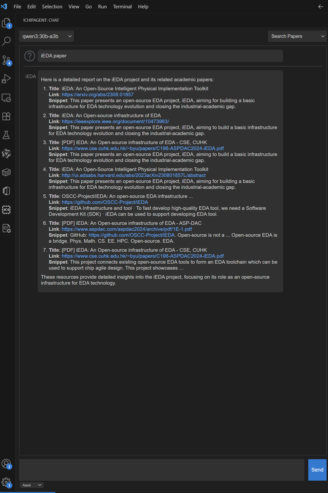
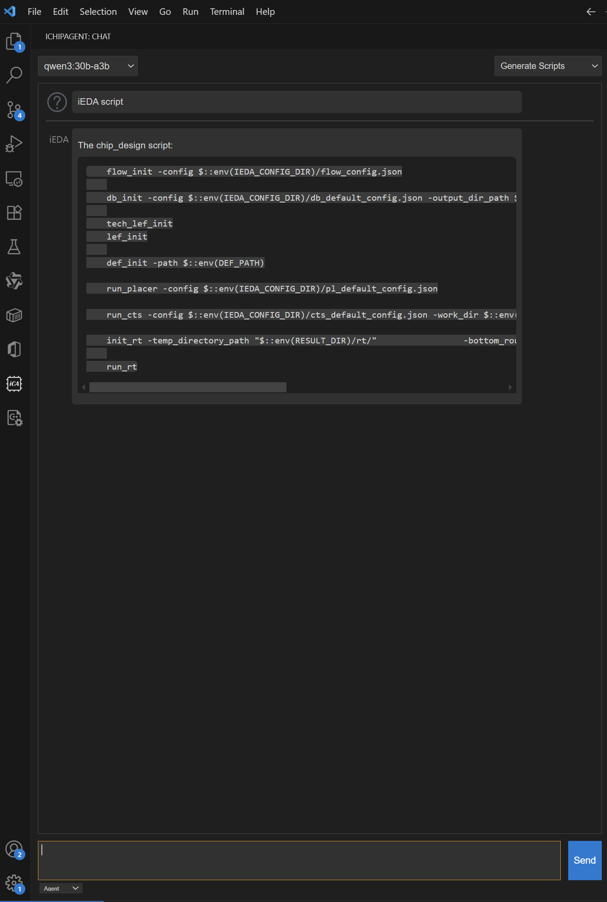
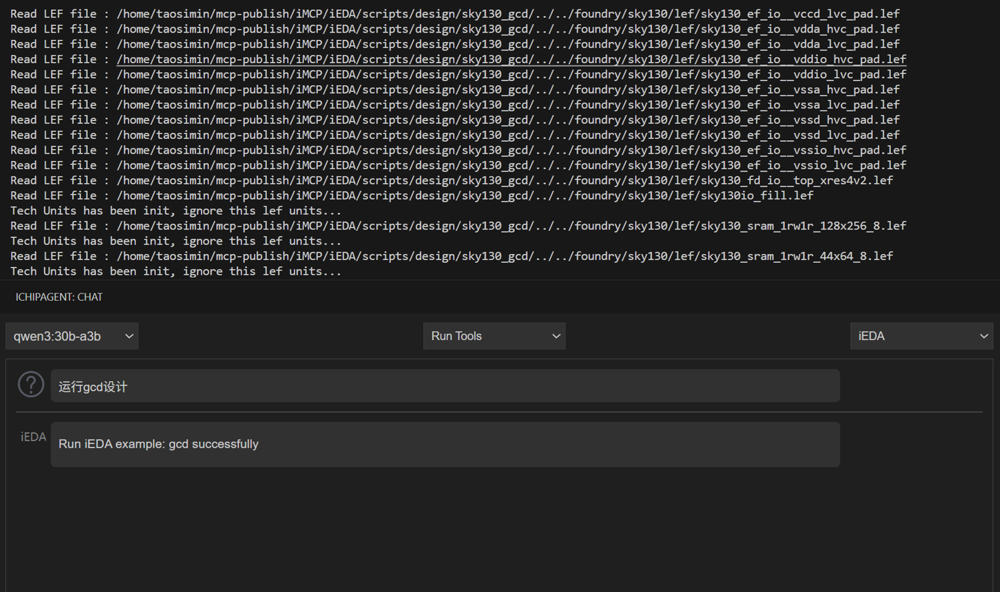

<div align="center">

 <h1>iChipAgent</h1>

<h3> A multi agents system for chip design.</h3>

<p align="center">
    <a title="GitHub Watchers" target="_blank" href="https://github.com/OSCC-Project/iChipAgent/watchers">
        
    </a>
    <a title="GitHub Stars" target="_blank" href="hhttps://github.com/OSCC-Project/iChipAgent/stargazers">
        
    </a>
    <a title="GitHub Forks" target="_blank" href="https://github.com/OSCC-Project/iChipAgent/network/members">
        
    </a>
</p>

[Chinese] | **English**

</div>


## Features

- **Question Answer** : Ask question about chip design.


- **Paper Search** : Search papers from google.



- **Generate EDA Tool Script**: Generate EDA tool script, cuurently support opensource EDA Tool iEDA.



- **Run EDA Tool**: Run EDA tool such as physical design tool with MCP protocol to complete chip design.




- **Report Analysis**: Analyze the report from EDA tool and provide summary and recommendation.


## Requirements

- The iChipAgent requires LLM(large language model) to run. We support commercial LLM such as GPT4o、Claude and open source LLM such as Qwen3. You need provide the API key of LLM in the settings.
- node >= v22.14
- npm >= 10.9

## Run

To run the extension, run the following command in the root directory of the extension to install the dependencies:

```bash
npm install
npm run compile
code --extensionDevelopmentPath=.
```
Or press `F5` to open a new window with your extension loaded.

## Testing the Extension

To test extension, you'll want to first install the @vscode/test-cli module, as well as @vscode/test-electron module that enables tests to be run in VS Code Desktop:

```bash
npm install --save-dev @vscode/test-cli @vscode/test-electron
npm run test
```

## Extension Settings

ctrl+Enter as shortcut to input message.


## Release Notes

### 0.0.1

Initial release of The iChipAgent.

## Owner
iEDA Team

## License
Mulan PSL v2


